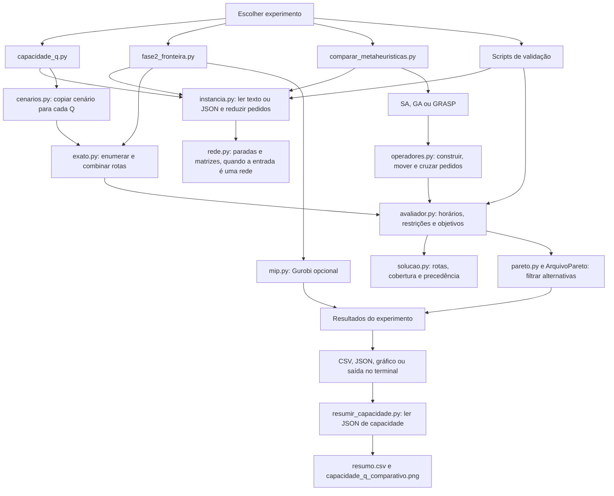
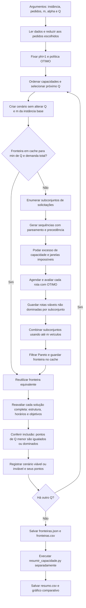
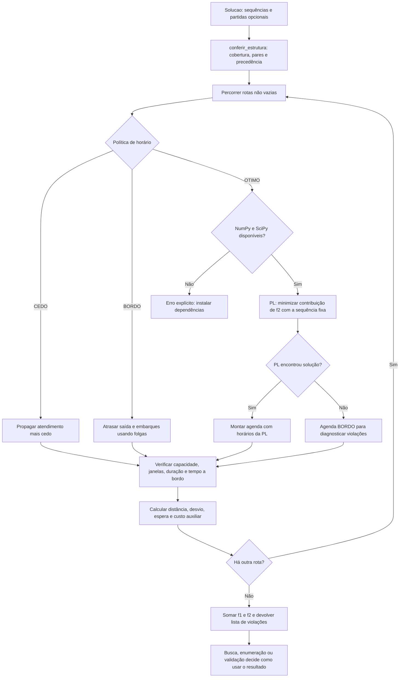
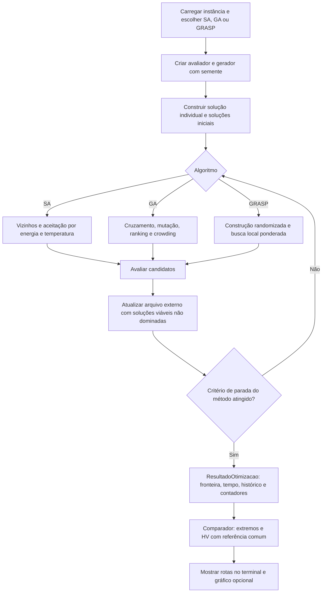

# Fluxogramas do código atual

Auditoria de 01/10/2026. O projeto é uma biblioteca com scripts independentes:
não há um programa principal que execute todas as etapas automaticamente.
Execute um dos arquivos em `codigo/experimentos/`. As setas abaixo representam
chamadas e passagem de dados, não processos simultâneos.

## 1. Visão geral dos pontos de entrada

O comparador usa BORDO por padrão; o avaliador isolado e o estudo exato de Q
usam OTIMO. O Gurobi constrói seu próprio modelo, sem chamar o avaliador durante
a otimização; a Fase 2 usa o avaliador depois para conferir os pontos do solver.

## 2. Estudo de capacidade Q=1 até 20

Se a fronteira estiver vazia, o JSON registra `inviavel`; o CSV de pontos não
possui linhas para aquele Q. O limite de seis pedidos protege contra o custo
combinatório da enumeração. O cache reaproveita Q acima da demanda total;
capacidades inferiores continuam sendo calculadas separadamente.

## 3. Avaliação compartilhada e políticas de horário

`avaliar_rota` trabalha com uma rota e não exige cobertura global: isso permite
avaliar construções parciais. `avaliar` verifica a solução completa.
`avaliar_com_B` recebe uma agenda externa e é usado para reproduzir `.res` e
conferir o Gurobi. Um movimento preservando estrutura ainda pode violar tempo
ou capacidade; viabilidade completa depende do avaliador.

## 4. Loop das metaheurísticas

Esse diagrama resume os métodos; o arquivo não recebe obrigatoriamente todo
vizinho intermediário. SA registra vizinhos viáveis; GA registra população e
descendentes; GRASP registra a construção e o resultado da busca local.
Os contadores atuais não contabilizam todas as avaliações internas.
