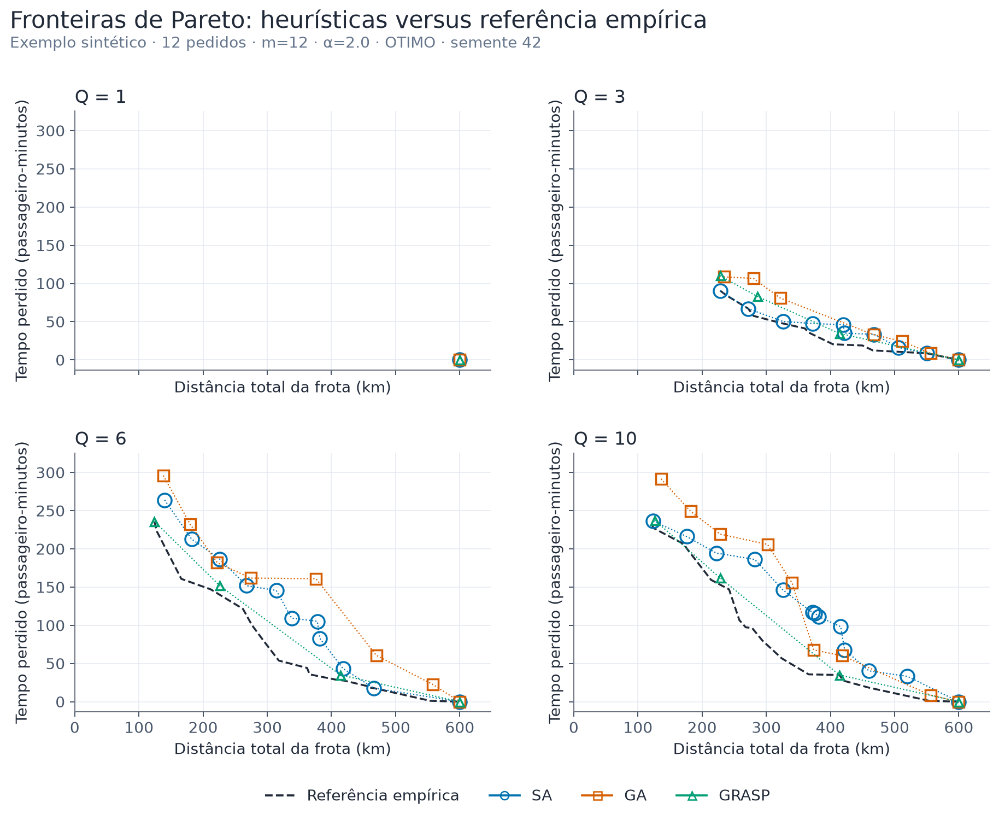
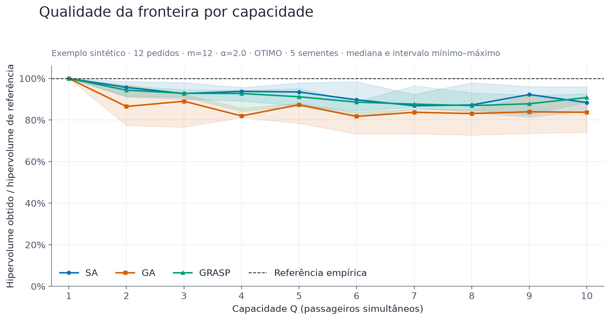
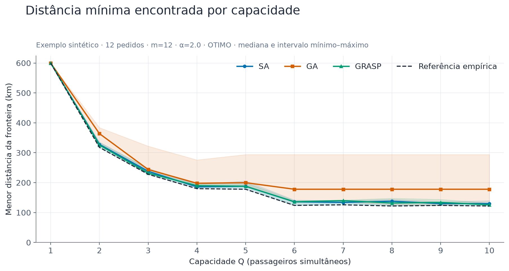
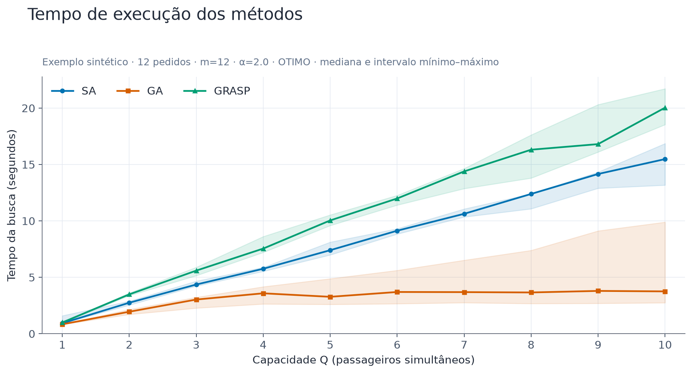
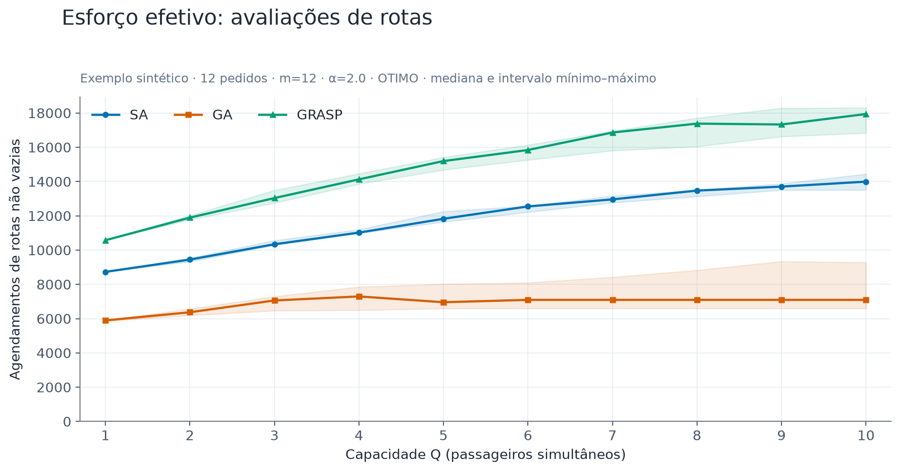
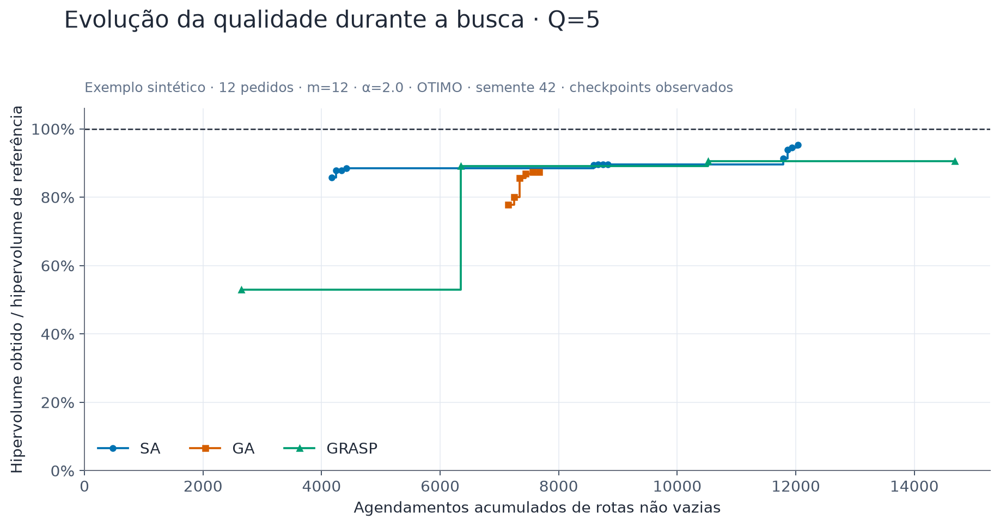
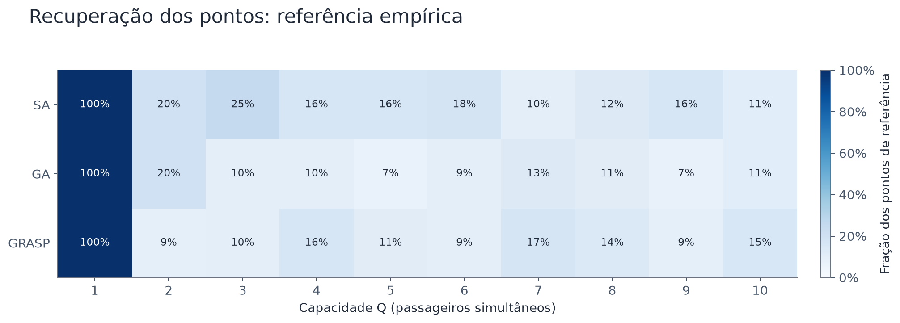
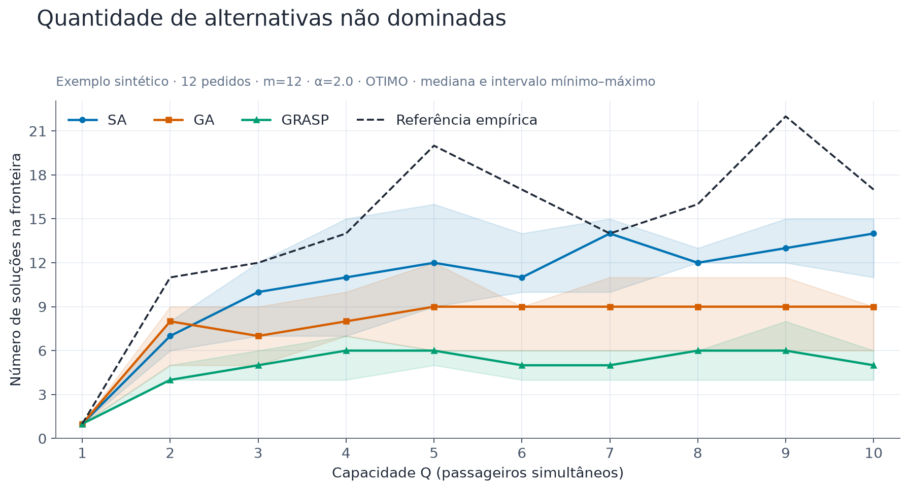
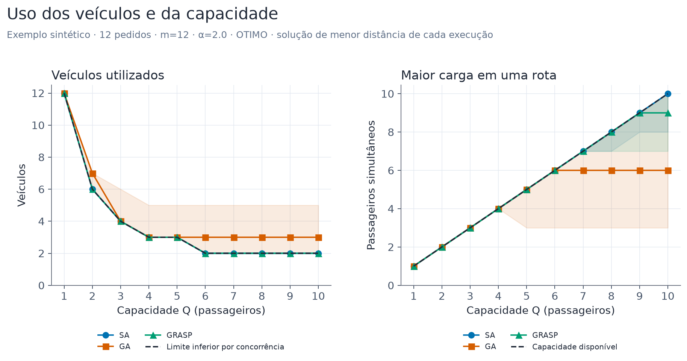
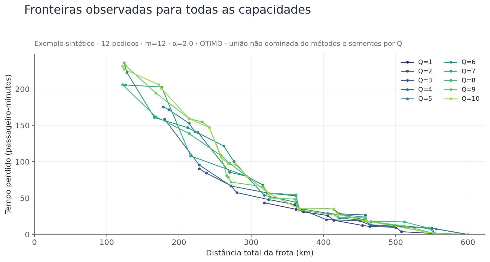

# Guia dos gráficos e resultados

## O que foi executado

150 execuções: 10 capacidades × 3 métodos × 5 sementes.
Exemplo sintético · 12 pedidos · m=12 · α=2.0 · OTIMO. Índices internos dos pedidos: [1, 2, 3, 4, 5, 6, 7, 8, 9, 10, 11, 12]; sementes: [7, 42, 2026, 314, 2718].
Dados sintéticos, phi=1: o eixo ambiental é distância em km, não emissão real calibrada.
Todos os pontos retornados foram reavaliados com programação linear para a sequência de cada rota.
A referência é empírica: união não dominada de todos os métodos e sementes, separadamente por Q. Não é gabarito nem prova de otimalidade; mudar a campanha pode mudar essa referência.

Agendas repetidas são reutilizadas em cache separado por execução. O cache foi conferido contra o agendador sem cache e não modifica as decisões. Tempo inclui esse cache; chamadas de agendamento incluem acertos no cache. Resoluções efetivas e acertos estão registrados no CSV/JSON.

Os métodos têm esforços distintos. Esta é uma campanha exploratória, não um ranking definitivo.
Faixas mostram mínimo–máximo entre 5 sementes; não são intervalos de confiança. A linha central é a mediana.
Capacidades maiores que a demanda total tornam-se redundantes. Patamares antes disso também podem ocorrer pela geometria e pelas janelas.

## Configuração e dados reproduzíveis

Configuração completa, versões, hash da entrada, hash dos fontes, rotas, horários e checkpoints: [execucoes.json](execucoes.json).
Métricas por capacidade/método/semente: [metricas.csv](metricas.csv).

## Resumo observado por capacidade

A distância abaixo é o menor valor na referência. As três últimas colunas mostram a mediana de qualidade relativa nas sementes; não comparam qualidade absoluta entre capacidades.

| Q | Menor distância de referência (km) | Pontos de referência | SA: HV relativo | GA: HV relativo | GRASP: HV relativo |
|---|---:|---:|---:|---:|---:|
| 1 | 600.0 | 1 | 100.0% | 100.0% | 100.0% |
| 2 | 318.0 | 11 | 95.7% | 86.5% | 94.4% |
| 3 | 228.0 | 12 | 92.7% | 89.0% | 92.8% |
| 4 | 180.0 | 14 | 93.8% | 82.0% | 92.8% |
| 5 | 178.0 | 20 | 93.5% | 87.3% | 91.2% |
| 6 | 124.0 | 17 | 89.7% | 81.7% | 88.6% |
| 7 | 126.0 | 14 | 86.9% | 83.7% | 87.7% |
| 8 | 122.0 | 16 | 87.2% | 83.1% | 86.9% |
| 9 | 124.0 | 22 | 92.3% | 84.0% | 87.8% |
| 10 | 122.0 | 17 | 88.4% | 83.7% | 90.8% |

## Como ler cada figura

### Fronteiras por método e capacidade

Mais à esquerda e abaixo é melhor. Cada símbolo é uma solução viável; os painéis usam a mesma escala.

**Eixos:** X = soma das distâncias de todos os veículos, em km; Y = tempo perdido total, em passageiro-minutos. O segundo objetivo soma espera após o horário desejado de coleta e o excesso de tempo a bordo em relação à viagem direta, ponderados pelo número de passageiros.

**Exemplo de unidade:** dez pessoas perdendo dois minutos cada somam 20 passageiro-minutos. Não é a duração total das viagens nem uma média por pessoa.

**Como comparar:** um ponto com menor X e menor Y domina outro. Quando um melhora X e piora Y, há um compromisso: a decisão depende da prioridade de operação e serviço. Compare também a aproximação ao tracejado dentro de cada painel.

**Limite:** o painel mostra apenas uma semente. Coincidência visual não demonstra que os métodos sempre geram o mesmo resultado. As linhas conectam alternativas discretas; um ponto intermediário na linha não é necessariamente realizável.

Uma semente por método. Símbolos sobrepostos indicam soluções coincidentes; linhas só guiam a leitura, não representam soluções contínuas.

[PNG](graficos/01_fronteiras_metodos.png) · [SVG vetorial](graficos/01_fronteiras_metodos.svg)

### Qualidade por Q

100% significa o mesmo hipervolume da referência: união não dominada dos métodos e sementes, para o mesmo Q. Valores menores revelam alternativas ainda não recuperadas.

**Eixos:** X = capacidade; Y = hipervolume da fronteira de uma execução dividido pelo hipervolume da referência do mesmo Q. Maior é melhor.

**O que é hipervolume:** após colocar os dois objetivos em escalas comparáveis, mede a área coberta pelas soluções em direção ao canto pior de referência. Recompensa simultaneamente proximidade a bons valores e cobertura dos compromissos. Todas as execuções usam uma normalização global e o mesmo canto: x=1,1 e y=1,1.

**Exemplo:** 80% significa 80% da área da referência, não 80% de passageiros atendidos e não um erro de 20% na distância. Um método pode obter uma boa razão sem recuperar exatamente todos os pontos.

**Comparação entre Q:** o denominador muda com Q. Portanto, 100% em Q=1 e Q=10 indica qualidade relativa semelhante; não indica mesmas distâncias ou mesmos tempos perdidos. Consulte os gráficos 1 e 3.

Mesma normalização para todas as capacidades e sementes; a faixa é mínimo–máximo, não intervalo de confiança.

[PNG](graficos/02_qualidade_por_q.png) · [SVG vetorial](graficos/02_qualidade_por_q.svg)

### Benefício e saturação da capacidade

Mostra quanto a capacidade adicional reduz a melhor distância. Um patamar indica saturação nessa instância.

**Cálculo:** em cada execução, seleciona o menor f1 entre as soluções da fronteira. Em seguida, resume esses mínimos pelas sementes. Menor é melhor.

**Exemplo do recorte pequeno após a correção de unidade:** o gabarito tem 24 km em Q=1, 16 km em Q=2 e 10 km de Q=3 em diante. Esse recorte possui só três passageiros. Os antigos valores 48/32/20 somavam minutos como quilômetros e foram substituídos.

**Patamares:** agrupar um passageiro a mais nem sempre elimina uma rota ou encurta um trajeto. Igualdade entre Q vizinhos pode ser um efeito legítimo. A solução com menor distância pode exigir mais espera ou desvio; o gráfico não afirma que ela é a melhor nos dois objetivos.

**Monotonicidade:** ao aumentar Q, todas as soluções antes viáveis continuam permitidas, mantendo os demais parâmetros. O ótimo de distância não pode piorar; a melhor solução encontrada por uma busca limitada pode piorar por acaso.

O extremo de distância não representa simultaneamente o melhor serviço; consulte a fronteira completa.

[PNG](graficos/03_distancia_por_q.png) · [SVG vetorial](graficos/03_distancia_por_q.svg)

### Custo computacional observado

Compara o tempo efetivamente gasto nesta máquina, incluindo construção e busca, sem incluir validação posterior ou enumeração exata.

**Eixos:** X = Q; Y = segundos gastos por execução na construção e otimização. O relógio é iniciado antes do algoritmo e parado quando ele retorna. A geração de gráficos, a enumeração e a conferência posterior não entram.

**Leitura:** a linha mostra o tempo mediano; a faixa mostra o menor e maior tempo nas sementes. Maior faixa indica variação observada, mas poucos ensaios não permitem caracterizar a distribuição.

**Uso:** avalie custo de obtenção das soluções juntamente com a qualidade. Um método rápido que retorna uma fronteira fraca não é automaticamente mais eficiente. Os tempos dependem da máquina e de outros processos ativos.

Os métodos têm parâmetros e esforços diferentes. Menor tempo isoladamente não certifica maior eficiência.

[PNG](graficos/04_tempo_execucao.png) · [SVG vetorial](graficos/04_tempo_execucao.svg)

### Esforço medido

Conta também as avaliações na construção e no cruzamento, omitidas pelos antigos contadores dos métodos.

**Eixos:** X = Q; Y = número de chamadas de agendamento de rotas não vazias durante a busca, incluindo construção inicial e cruzamento. Menor representa menos trabalho desse tipo.

**Distinção:** uma avaliação de solução pode agendar vários veículos. Logo, 500 chamadas não significam 500 soluções completas nem 500 movimentos. Rotas de comprimentos diferentes também têm custos diferentes.

**Uso:** ajuda a explicar o tempo do gráfico 4 e expõe diferenças de orçamento. Se um método recebe mais esforço, a diferença de qualidade pode decorrer desse orçamento. Esta campanha mede as chamadas, mas não impõe o mesmo limite aos três métodos.

Conta chamadas de agendamento de rota, não soluções completas, iterações ou necessariamente resoluções bem-sucedidas de PL.

[PNG](graficos/05_esforco_computacional.png) · [SVG vetorial](graficos/05_esforco_computacional.svg)

### Convergência observada

A curva registra a qualidade do arquivo Pareto ao longo do esforço acumulado. Subidas indicam novas alternativas úteis.

**Eixos:** X = esforço acumulado até um checkpoint; Y = qualidade relativa do arquivo Pareto naquele instante. São mostrados um Q e uma semente, indicados no título.

**Degraus:** uma subida registra melhora no conjunto de alternativas; um trecho horizontal indica que os checkpoints não registraram ganho de hipervolume. Isso não significa que o algoritmo deixou de testar soluções.

**Uso:** compare quanto esforço foi necessário para chegar a um nível de qualidade. O ponto inicial é o primeiro checkpoint real, não um estado artificial em zero. Os métodos registram checkpoints em momentos diferentes, e não há medição a cada movimento.

**Limite:** a convergência de uma semente não representa a variabilidade de todas as execuções; consulte a faixa do gráfico 2.

Cada método registra checkpoints próprios. Não há interpolação nem observação a cada movimento; só uma semente é mostrada.

[PNG](graficos/06_evolucao_busca.png) · [SVG vetorial](graficos/06_evolucao_busca.svg)

### Recuperação de pontos de referência

Cada célula mostra a média da fração de pontos de referência recuperados nas sementes; coincidência usa tolerância 1e-6 nos objetivos.

**Eixos:** colunas = Q; linhas = métodos; cada célula = média da proporção dos pontos de referência recuperados nas sementes. Azul mais escuro significa maior proporção.

**Exemplo:** se a referência tem três pontos e uma execução encontra dois deles, ela recupera 66,7%. A célula é a média dessa fração entre as sementes, não a recuperação pela união das execuções.

**Diferença para o gráfico 2:** esta medida exige coincidência dos dois objetivos dentro da tolerância; hipervolume atribui valor a aproximações. Uma solução quase igual à referência pode contribuir muito para o hipervolume e não contar como ponto recuperado.

**Limite da referência empírica:** ela também foi construída usando estes métodos. Um ponto encontrado exclusivamente por uma semente pode reduzir a recuperação das outras. A medida descreve cobertura do conjunto observado, não acerto contra um ótimo comprovado.

Essa medida verifica pontos coincidentes, enquanto hipervolume também reconhece aproximações úteis.

[PNG](graficos/07_recuperacao_pontos.png) · [SVG vetorial](graficos/07_recuperacao_pontos.svg)

### Número de alternativas

Mostra quantas escolhas de compromisso cada execução encontrou, usando os mesmos critérios de dominância.

**Eixos:** X = Q; Y = quantidade de pares de objetivos não dominados e distintos que a execução retornou. A linha de referência mostra a quantidade de alternativas na referência de cada Q.

**Exemplo:** três pontos significam três compromissos distintos entre distância e tempo perdido. Rotas diferentes com os mesmos objetivos não aparecem como alternativas adicionais neste contador.

**Uso:** avalie variedade junto com qualidade. Dez alternativas ruins podem ser dominadas por duas boas; portanto, mais pontos não significa melhor resultado. Um método também pode retornar mais pontos que a referência se seus pontos forem dominados apenas por soluções encontradas pelos outros métodos.

Mais pontos não implica maior qualidade: uma fronteira com muitos pontos pode ser dominada por outra menor.

[PNG](graficos/08_cardinalidade.png) · [SVG vetorial](graficos/08_cardinalidade.svg)

### Uso dos veículos e da capacidade

Mostra o agrupamento efetivamente encontrado: quantidade de veículos e maior ocupação na solução de menor distância de cada execução.

**Seleção da solução:** em cada método/Q/semente, escolhe o menor f1; em caso de empate, o menor f2. Os dois painéis descrevem essa mesma solução, resumida entre sementes.

**Painel esquerdo:** conta veículos com pelo menos um atendimento. O tracejado é ceil(12/Q), um limite inferior comprovado para esta entrada: todos os 12 passageiros precisam ser coletados antes de qualquer entrega. Se a linha ficar acima dele, o método utilizou mais veículos do que esse limite exige; isso não comprova que o limite permite a menor distância ou melhor serviço.

**Painel direito:** mostra a maior carga simultânea em qualquer veículo. Um valor de 8 em Q=10 indica pelo menos um veículo com oito pessoas, mas não indica dois lugares ociosos em todos os veículos. Não é taxa média de ocupação.

**Uso:** esclarece se Q foi efetivamente aproveitado. Mais capacidade disponível não obriga a busca a usá-la: destinos, janelas, qualidade de serviço e orçamento podem favorecer agrupamentos menores.

Mediana e mínimo–máximo entre sementes. Carga máxima é um pico, não ocupação média. O limite de veículos vale porque todas as coletas antecedem qualquer entrega neste cenário.

[PNG](graficos/09_uso_capacidade.png) · [SVG vetorial](graficos/09_uso_capacidade.svg)

### Efeito de Q na fronteira inteira

Cada cor representa a união não dominada observada para um Q. Compare distância em níveis semelhantes de tempo perdido, ou vice-versa.

**Eixos:** os mesmos do gráfico 1; agora a comparação é entre capacidades, usando todas as sementes e os três métodos. Mais próximo do canto inferior esquerdo é melhor.

**Leitura:** compare a distância que cada Q conseguiu para um tempo perdido semelhante. Assim você analisa o efeito da capacidade sobre vários compromissos, sem resumir tudo ao extremo de menor distância.

**Sobreposições:** trechos coincidentes são resultados legítimos. Dois Q distintos podem permitir as mesmas boas rotas. Maior quantidade de pedidos e simultaneidade removem a saturação trivial por demanda insuficiente, mas não garantem uma fronteira distinta para cada Q.

**Limite:** as referências são condicionadas ao que foi encontrado nesta campanha. Uma referência pior em Q maior sugere investigar orçamento e operadores; não permite concluir que a capacidade maior prejudicou o conjunto de soluções viáveis.

São referências empíricas. Cruzamentos podem decorrer de buscas incompletas; não provam que aumentar a capacidade piora o ótimo.

[PNG](graficos/10_fronteiras_todos_q.png) · [SVG vetorial](graficos/10_fronteiras_todos_q.svg)

## Os gráficos anteriores

`fase2_fronteira_pr01r5.png` compara políticas de agendamento OTIMO e BORDO em cinco pedidos de volta; não compara SA, GA e GRASP.
`capacidade_q_comparativo.png` mostra apenas os extremos da amostra antiga de ida com m=3 e m=5. As curvas coincidem porque aquela amostra saturou já em Q=1.

## Próximos passos

1. Ampliar a concorrência e quantidade de pedidos, usando várias instâncias e diferentes frotas.
2. Igualar o orçamento de busca pelo esforço medido e repetir com mais sementes; a campanha atual só mede o esforço, não o limita igualmente.
3. Calibrar parâmetros de SA/GA/GRASP em instâncias separadas das usadas na comparação final.
4. Padronizar as buscas ponderadas e revisar o tratamento de inviabilidade e diversidade.
5. Estudar alpha=1.5/2 e cenários com mais/menos veículos sem misturar seus efeitos com Q.
6. Para emissões reais, adotar redes e fatores por veículo calibrados; com phi(Q), melhoria de emissão ao aumentar Q deixa de ser garantida.
7. Alinhar o relatório acadêmico ao conjunto de métodos escolhido e consolidar a campanha final.
